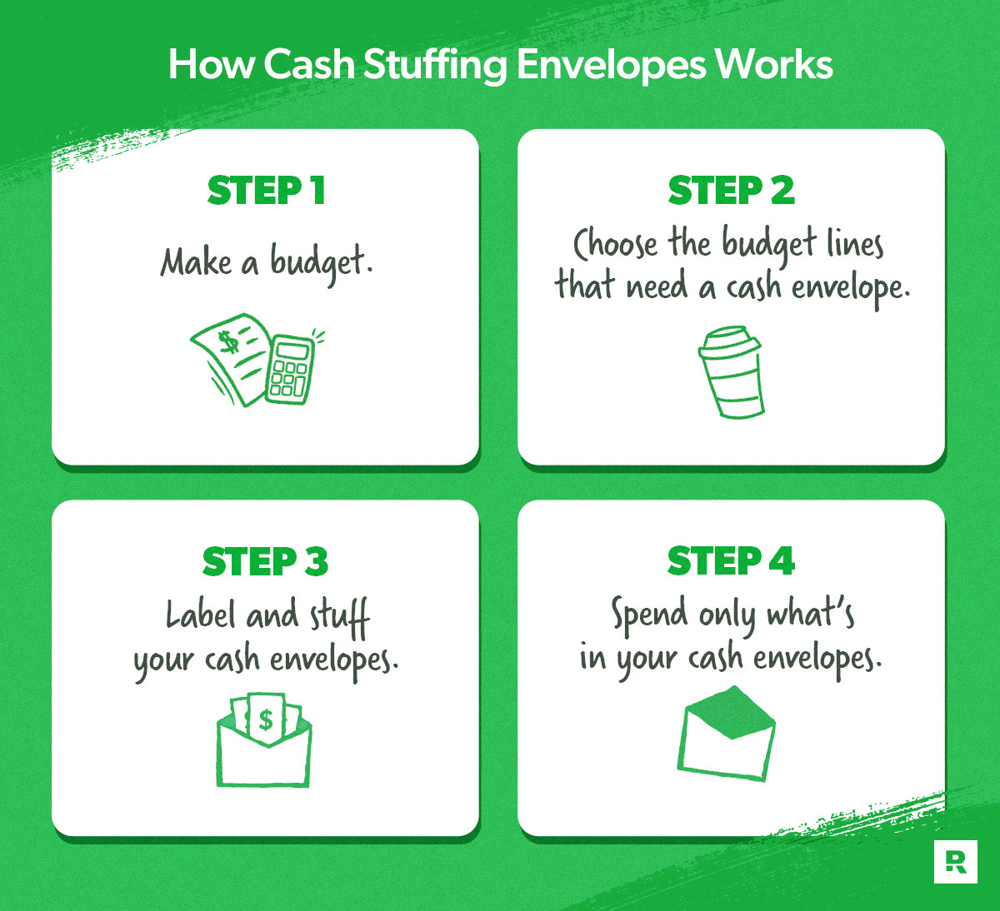

# Personal Budget API

A REST API for managing personal finances using the envelope budgeting method. Set a total budget, divide it into category envelopes, and track spending per envelope.

Built with Node.js and Express 5.

## What Is Envelope Budgeting?



Learn more about the envelope budgeting method: [Basics of Envelope Budgeting — Manulife Bank](https://www.manulifebank.ca/personal-banking/plan-and-learn/personal-finance/basics-of-envelope-budgeting.html)

## Getting Started

### Prerequisites

- Node.js v18+

### Installation

```bash
npm install
```

### Running the Server

```bash
# Development (auto-restart on changes)
npm run dev

# Production
npm start
```

The server runs at `http://localhost:3000`.

### Seed Data

Populate the app with sample data (server must be running):

```bash
npm run seed
```

### Tests

```bash
npm test
```

## API Endpoints

All responses follow the format:

```json
{ "success": true, "data": "..." }
{ "success": false, "message": "Error description" }
```

### Budget

| Method | Endpoint | Description              | Body                 |
| ------ | -------- | ------------------------ | -------------------- |
| GET    | /budget  | Get the current budget   | -                    |
| POST   | /budget  | Set or update the budget | `{ budget: Number }` |

The budget cannot be lowered below the total amount allocated to envelopes.

### Envelopes

| Method | Endpoint       | Description             | Body                               |
| ------ | -------------- | ----------------------- | ---------------------------------- |
| GET    | /envelopes     | Get all envelopes       | -                                  |
| GET    | /envelopes/:id | Get a specific envelope | -                                  |
| POST   | /envelopes     | Create an envelope      | `{ name: String, amount: Number }` |
| PUT    | /envelopes/:id | Update an envelope      | `{ name: String, amount: Number }` |
| DELETE | /envelopes/:id | Delete an envelope      | -                                  |

- `amount` is in dollars (e.g., `400` = $400.00), stored internally as cents
- Envelope names must be unique (case-insensitive)
- Envelope amount cannot exceed the remaining budget

### Spendings

| Method | Endpoint                   | Description                           | Body                               |
| ------ | -------------------------- | ------------------------------------- | ---------------------------------- |
| GET    | /spendings                 | Get all spendings                     | -                                  |
| GET    | /spendings/:envelopeId     | Get spendings for a specific envelope | -                                  |
| POST   | /spendings/:envelopeId     | Create a spending for an envelope     | `{ name: String, amount: Number }` |
| DELETE | /spendings/:spendingId     | Delete a specific spending            | -                                  |
| DELETE | /spendings/All/:envelopeId | Delete all spendings for an envelope  | -                                  |
| DELETE | /spendings                 | Delete all spendings                  | -                                  |

- Spending amount cannot exceed the envelope's remaining budget

## Project Structure

```
personal_budget/
  app.js              - Server entry point
  routes/
    api.js            - Express app setup and route mounting
    budget.js         - Budget route handlers
    envelopes.js      - Envelope route handlers
    spendings.js      - Spending route handlers
    middleware.js     - Validation and param middleware
    utiles.js         - In-memory data store and helpers
    seed.js           - Seed script for development
  test/
    test.utiles.js    - Unit tests for data layer
    test.middleware.js - Unit tests for middleware
    test.api.js       - Integration tests for API endpoints
```
